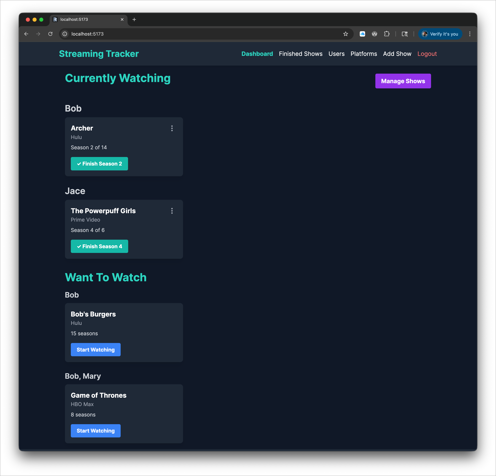
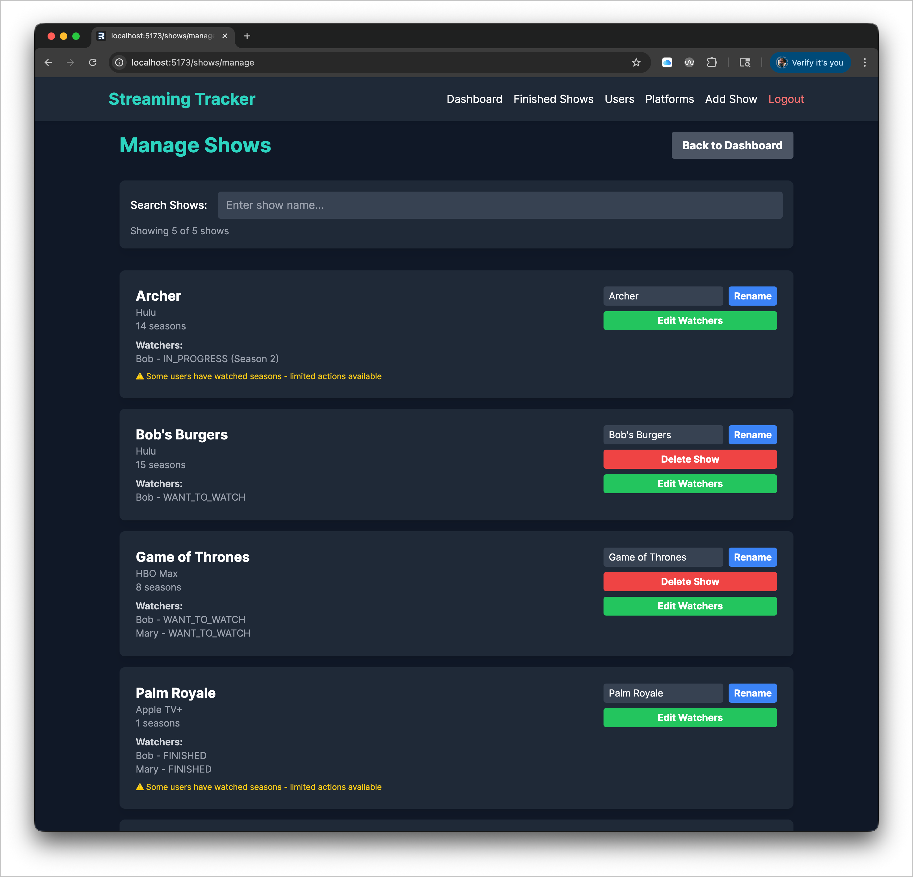
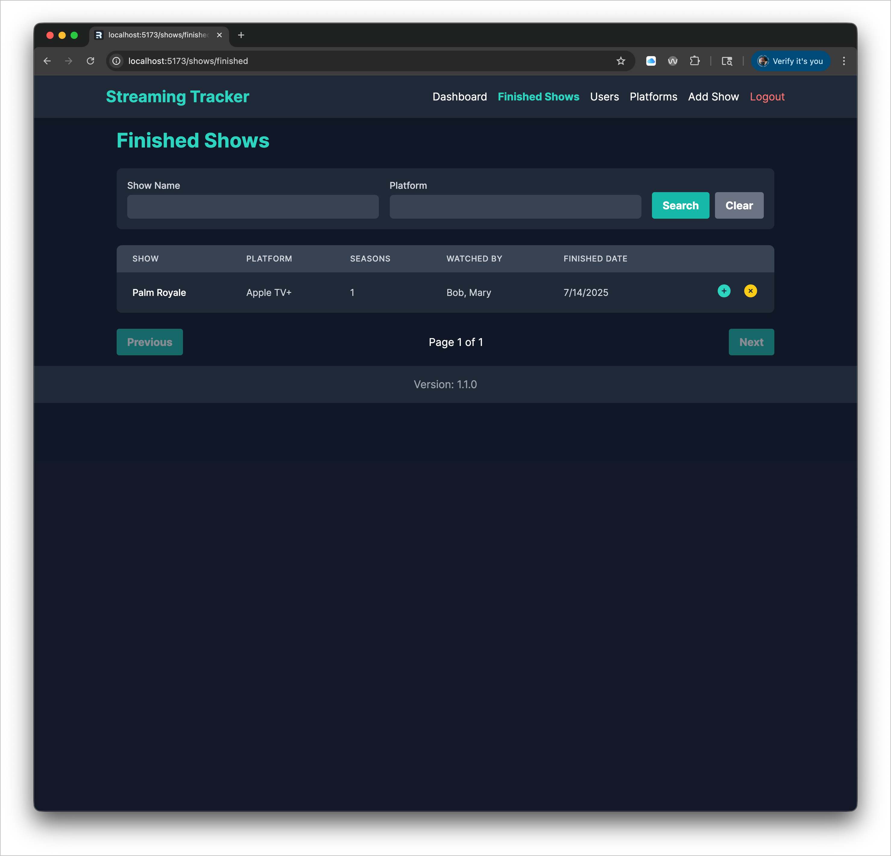
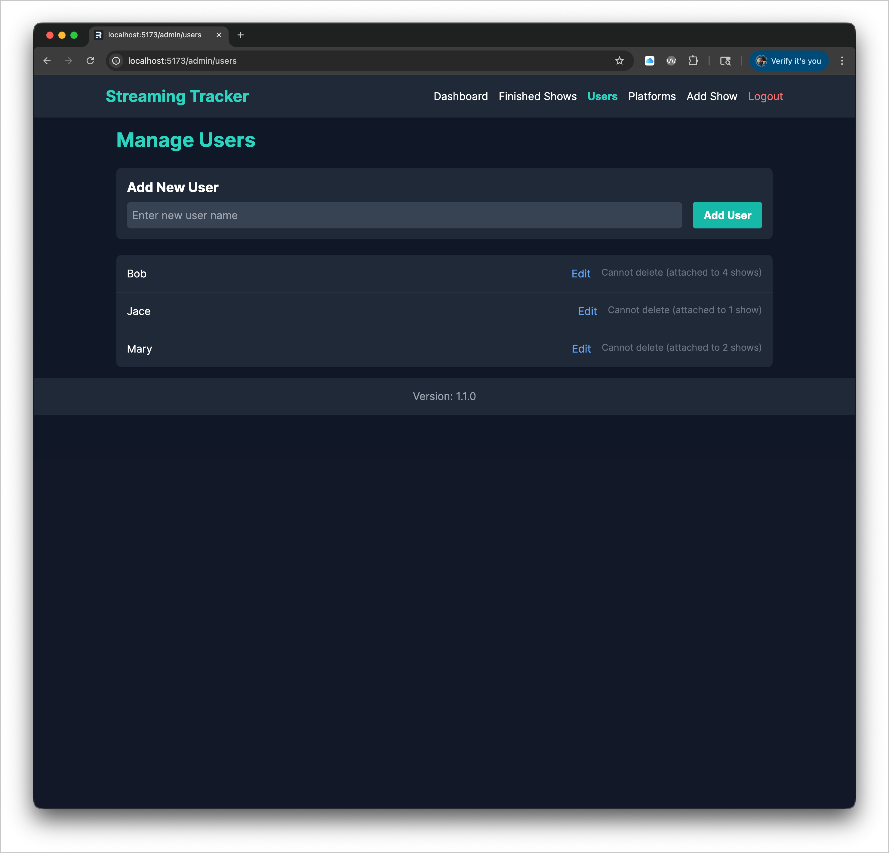
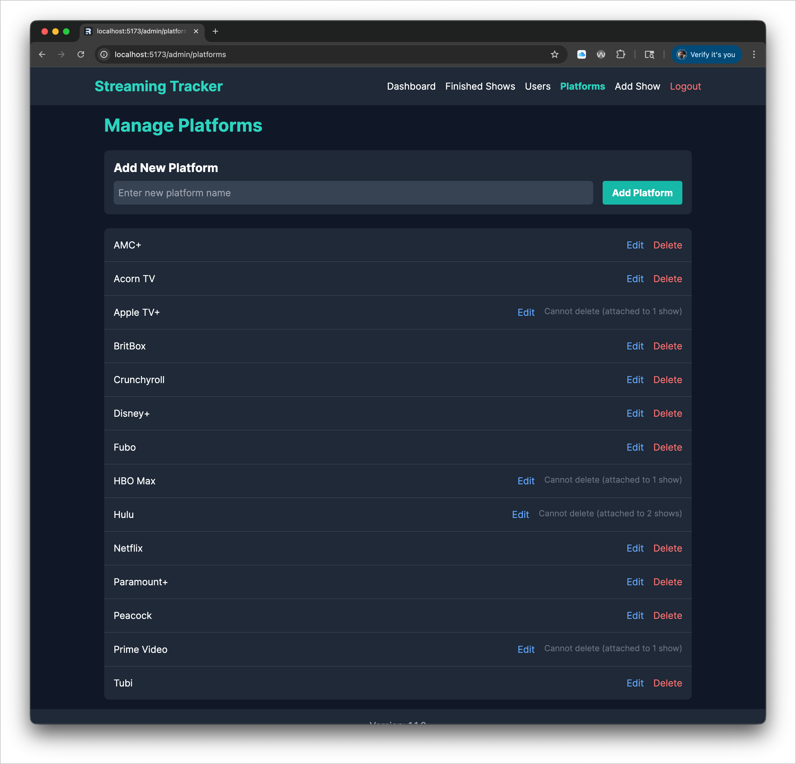
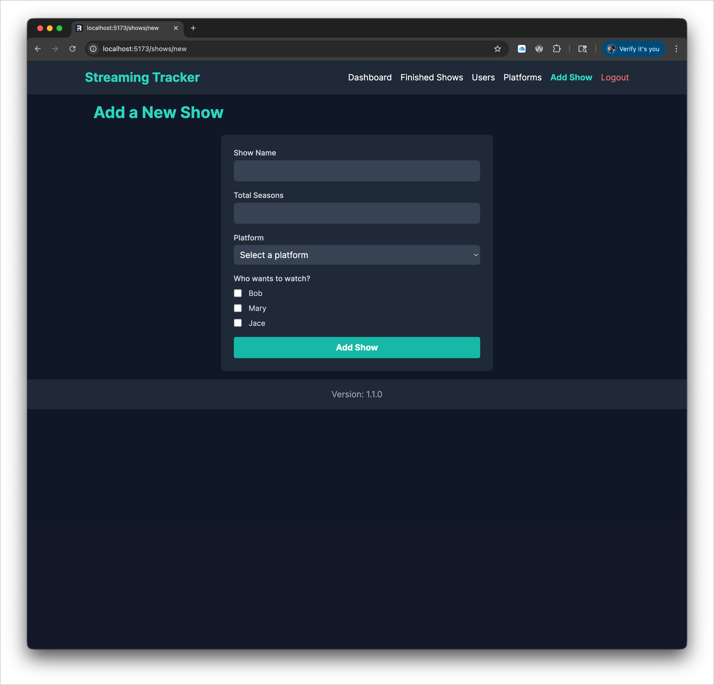

# Streaming Tracker

Streaming Tracker is an application designed for my family to keep track of who is streaming what. It also allows me to keep a watchlist of upcoming shows and those recommended by friends. This application is written in Remix and uses SQLite.














## Getting Started

### Prerequisites

- Node.js (v14 or later)
- npm (v6 or later)

### Installation

1. Clone the repository:
   git clone https://github.com/your-username/streaming-tracker.git
   cd streaming-tracker

2. Install dependencies:
   npm install

3. Set up the environment variables:
   cp .env.example .env

Edit the `.env` file and fill in the necessary values.

4. Initialize the database:
   npm run db:migrate

### Running the Application

1. Start the development server:
   npm run dev

2. Open your browser and navigate to `http://localhost:3000`

### Building for Production

1. Build the application:
   npm run build

2. Start the production server:
   npm start

## Using Docker Compose

First, create a file named `.env`. This file must contain 4 secrets:

- **PAGE_SIZE** - Number of items to show per page
- **DATABASE_URL** - Path to SQLite database file
- **AUTH_PASSWORD** - Password to login to the application
- **SESSION_SECRET** - Key used to create cookies

Here is an example:

```
PAGE_SIZE=15
DATABASE_URL=file:/app/db/streamingtracker.db
AUTH_PASSWORD=password
SESSION_SECRET=abcdefghijk
```

In most cases you will only need to change **AUTH_PASSWORD** and **SESSION_SECRET**. Now, create your `compose.yml` file.

```yaml
services:
  streamingtracker:
    container_name: streamingtracker
    image: adampresley/streaming-tracker:latest
    env_file:
      - ./.env
    volumes:
      - ./db:/app/db
    ports:
      - 127.0.0.1:3000:3000
```

This sample compose file forwards local port 3000 to the application. It also expects you to have a subdirectory named `db` where the database will be stored.

Finally, run it.

```bash
docker compose up --build
```

Access the application at `http://localhost:3000`

